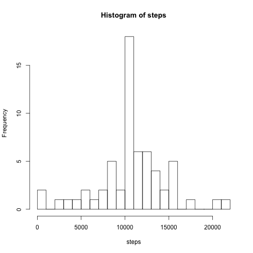
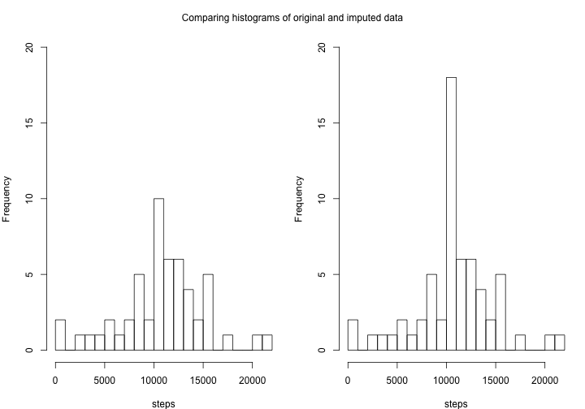

## Initial data setup


```r
library(dplyr, warn.conflicts = FALSE)
library(lubridate)
library(xtable)
library(ggplot2)

## numbers >= 10^6 (4+2) will be denoted in scientific notation,
## and rounded to 2 digits
## http://yihui.name/knitr/demo/output/
## useful for when we print mean & median inline in the next section
options(scipen = 2, digits = 2)

filename="activity.csv"
if(!file.exists(filename)) {
    unzip("activity.zip")
}
if(!file.exists(filename)) {
    stop("Cannot find ",filename," file")
}

activity <- read.csv("activity.csv")

activity <- tbl_df(activity) %>%
    transmute(steps, date = ymd(date), interval)

dailysummary <- activity %>%
                group_by(date) %>%
                summarize(steps = sum(steps))
meandaily_steps   <- mean(dailysummary$steps, na.rm = TRUE)
mediandaily_steps <- median(dailysummary$steps, na.rm = TRUE)

intervalsummary <- activity %>%
                    group_by(interval) %>%
                    summarize(meansteps = mean(steps, na.rm = TRUE), medsteps = median(steps, na.rm = TRUE))
```

## Imputing missing values

<!-- note to self: http://rmarkdown.rstudio.com/
    If you are not using RStudio then you simply need to call the
    rmarkdown::render function, for example:

    rmarkdown::render("input.Rmd")

    Note that in the case using the "Knit" button in RStudio the basic
    mechanism is the same (RStudio calls the rmarkdown::render function under
    the hood)

    ...but this requires pandoc:
    > rmarkdown::render("PA1_template.Rmd")
    Error: pandoc version 1.12.3 or higher is required and was not found.

    ...which in turn requires either a lot of Haskell, or RStudio:
    http://r.789695.n4.nabble.com/Apply-rmarkdown-render-outside-the-RStudio-don-t-find-pandoc-td4696190.html
    https://github.com/rstudio/rmarkdown/blob/master/PANDOC.md
-->

> Note that there are a number of days/intervals where there are missing values (coded as NA). The presence of missing days may introduce bias into some calculations or summaries of the data.
>
> 1. Calculate and report the total number of missing values in the dataset (i.e. the total number of rows with NAs)
> 1. Devise a strategy for filling in all of the missing values in the dataset. The strategy does not need to be sophisticated. For example, you could use the mean/median for that day, or the mean for that 5-minute interval, etc.
> 1. Create a new dataset that is equal to the original dataset but with the missing data filled in.
> 1. Make a histogram of the total number of steps taken each day and Calculate and report the mean and median total number of steps taken per day. Do these values differ from the estimates from the first part of the assignment? What is the impact of imputing missing data on the estimates of the total daily number of steps?

#### Number of missing values in the dataset


```r
missing <- nrow(filter(activity, is.na(steps)))
missingpercentage <- format((missing / nrow(activity)) * 100, digits = 4)
cat(paste("There are", missing, "rows in the table, representing", missingpercentage, "percent of the total rows"))
```

```
## There are 2304 rows in the table, representing 13.11 percent of the total rows
```

#### Impute Strategy 1: based on values present in a day with some non-NA values

The easiest & most reasonable strategy, to my mind, is to fill any missing interval with the mean for the appropriate 5-minute interval.  However, it takes a bit of the fun out of divising if that strategy is drectly in the question.  A second-order approximation would combine the two suggestions, using any data available for a day with missing values to help compute an appropriate in-fill value.

i.e. if the NA value is at 8:35am, we want to insert the average number of steps (206) if it otherwise looks like the subject was having an average day.  If indications are that the subject's activity was 50% of normal, we should insert 103 steps instead.  Our indicator of activity during a day with missing values cannot be a simple average of the present values, unless you are comparing that average with other days with missing values during the same intervals.

So let's go whole hog here, and use the following algorithm:

1. mean_daily_activity = sum of all the steps in the intervalsummary table we computed earlier.

1. to compute the activity level of a given day:

    1. create a vector of boolean values, indicating which intervals in the day were NA (FALSE) and which were not (TRUE)
   
    2. compute a sum of activity in the given day, omitting NA values
   
    3. use the vector from step #1 to extract only the values from the intervalsummary table that correspond to non-NA values in the day in question
   
    4. compute a sum of activity from the values in step #3
   
    5. divide the sum in step #2 (this day's activity level) by the value in step #4 (the average activity value if missing data in the same places as this day) -- this value represents the percentage of activity of the day under consideration compared to an average day
   
1. for each NA value in the given day, insert the corresponding value from the same interval in the intervalsummary table, multiplied by the percentage-activity level for the day

Unwrapping this slightly, what we'll do is:
* Create a function to compute the activity_level_percentage of a day
* Create and populate a new table with columns date and activity_level_percentage
* Create a new table that replaces any NA from activity with activity_level_percentage(for the date) * average steps for the interval


```r
compute_activity_level <- function(date) {
    na_mask <- filter(activity, date == ymd(date)) %>%
               select(steps) %>%
               is.na %>%
               as.vector
    if (all(na_mask)) {
        # all values are NA, so in the absence of any other information, assume activity is average
        # return 1 -- or something
    }

    # stopped coding this when I realized it wasn't going to work
}
```

Great.  All that thinking, and then I realize that there are no days with a partial set of NA values -- either all values for a day are NA, or none are.

#### Impute Strategy 2: Use the mean

Unfortunately, as the following code snippet shows, the missing values in this
data set span entire dates at a time -- there are no dates with only partial
missing values.


```r
missingdata_by_date <- activity %>%
                        transform(na = is.na(steps)) %>%
                        group_by(date) %>%
                        summarize(NAs = sum(na))

missingdata_table <- table(missingdata_by_date$NAs)
# make the results a little clearer
names(missingdata_table) <- c("Days missing 0 values", "Days missing 288 values")
missingdata_table
```

```
##   Days missing 0 values Days missing 288 values 
##                      53                       8
```

So we don't have any indication from the date itself as to the level of
activity.  Any intelligent attempt to fill in the values for the day would
have to base variance from patterns based on day of the week, day of the
month, surrounding days activity, etc.

As I haven't got weeks to spend on this assignment, I'll just fill in any NA
value for a given interval with the median number of steps for that interval
as measured across the entire data set.  Still, let's make sure that adding up
all the median-interval-step-values doesn't result in a daily step total that
varies from the average step value for a day.

*TODO nicer output*

```r
intervalsmean_sum = sum(intervalsummary$meansteps)
intervalsmedian_sum = sum(intervalsummary$medsteps)
mediandaily_steps - intervalsmedian_sum
```

```
## [1] 9624
```

```r
mediandaily_steps - intervalsmean_sum
```

```
## [1] -1.2
```

Clearly I don't want to use the **median** value of the steps across all
values of interval X.  I'll use the **mean** value instead, but also `round()` the average, as a
fractional number of steps doesn't make much sense. 

#### (Strategy 2) Create a new data set with the missing data filled in

So here we create a short
function to replace any NA values -- it requires the steps value and the
interval value as input.  We then use `mapply()` to pass the steps and
interval values to this function in order to build ourselves a new steps
column that imputes missing values.  Finally, we use data.frame and tbl_df to
re-assemble an activity table in dplyr data frame format.


```r
complete_steps <- function(steps, interval) {
    newsteps <- steps
    if (is.na(steps)) {
        newsteps <- round(intervalsummary[intervalsummary$interval==interval,]$meansteps)    
    }
    newsteps
}

newstepscol <- with(activity, mapply(complete_steps, steps, interval))
newactivity <- tbl_df(data.frame(steps = newstepscol, date = activity$date, interval = activity$interval))
head(newactivity)
```

```
## Source: local data frame [6 x 3]
## 
##   steps       date interval
## 1     2 2012-10-01        0
## 2     0 2012-10-01        5
## 3     0 2012-10-01       10
## 4     0 2012-10-01       15
## 5     0 2012-10-01       20
## 6     2 2012-10-01       25
```

#### (Strategy 2) Histogram, mean, median, and discussion of new data set

Now we make a histogram, and compute the mean and median of the new set.  I
don't expect the mean & median to change, though perhaps the histogram will
change slightly, increasing the peak at the middle.

We'll put the new and old mean & median values into a table.  Because it's no
fun to learn stuff on the slides and not use ALL of it!

*TODO lattice plot, less squished*

*TODO spacing between xtable and the text*


```r
ndailysummary <- newactivity %>%
		 group_by(date) %>%
		 summarize(steps = sum(steps))

with(ndailysummary, hist(steps,30))
```

 

```r
nmeandaily_steps   <- mean(ndailysummary$steps, na.rm = TRUE)
nmediandaily_steps <- median(ndailysummary$steps, na.rm = TRUE)

results <- c(meandaily_steps, mediandaily_steps,
	     nmeandaily_steps, nmediandaily_steps)
dim(results) <- c(2,2)
rownames(results) <- c("orig data", "infilled data")
colnames(results) <- c("mean", "median")
print(xtable(results, center=c("r","r")), type = "html", html.table.attributes="border=0")
```

<!-- html table generated in R 3.1.2 by xtable 1.7-4 package -->
<!-- Mon Mar 16 00:09:19 2015 -->
<table border=0>
<tr> <th>  </th> <th> mean </th> <th> median </th>  </tr>
  <tr> <td align="right"> orig data </td> <td align="right"> 10766.19 </td> <td align="right"> 10765.64 </td> </tr>
  <tr> <td align="right"> infilled data </td> <td align="right"> 10765.00 </td> <td align="right"> 10762.00 </td> </tr>
   </table>

We can see that *these values differ* **only slightly** *from the estimates from the first part of the assignment.*  However, we can see from the histogram that my method of imputing missing data greatly skews the histogram, making it appear that the individual walks *exactly* the average number of steps per day much more often than they probably do in relality.

However, this method *does not alter the estimate of the total number of daily steps*.  The original data set contains 61 days worth of data, but the data for 8 days is missing.  Therefore, our early calculations show that the average daily number of steps is 10766.19 over 53 days (for a total of 570608 steps).  Our imputation changes the average only slightly to 10765.64 per day over 61 days (for a total of 656704).  While the totals are different, this is only because there are an additional 8 days worth of data.

One more set of graphs to show us the two histograms, side-by-side

*TODO lattice plot -- or ggplot2*

```r
par(mfrow = c(1,2),
    mar = c(4,4,1,1), oma = c(0,0,2,0))
# mfrow -- 1 row of plots, 2 columns
#  mar  -- margins bottom, left, top, right
#  oma  -- outer margins bottom...

with( dailysummary, hist(steps,30, ylim = c(0,20), main=""))
with(ndailysummary, hist(steps,30, ylim = c(0,20), main=""))
mtext("Comparing histograms of original and imputed data", outer = TRUE)
```

 

#### Impute Strategy 3: use daytype and `rnorm()`

(see [PA1_template.md][PA1_template.md], the completed assignment)

## Other Notes removed from the completed assignment

It would have been nice to make the histogram plots via ggplot in the latter
sections, and less squished.

*TODO lattice plot -- or ggplot2*
